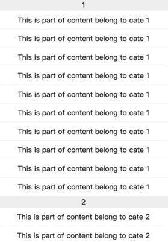

  粘性头部是一种(StickyHeader)在长列表中比较常用的组件，那么如何实现一个react粘性头部组件呢？

  -----
  
  如何实现XXX的问题一概参照将大象塞进冰箱需要几步：
  
  ## 构建一个简单的长列表。

  ```js
  export default ({ listData }) => {
    return (
      <div className="long-list">
        {(listData || []).map(({ cate, content }, index, arr) => (
          <Fragment key={content + index}>
            {(arr[index - 1] || {}).cate !== cate && (
              <div className="list-cate">{cate}</div>
            )}
            <div className="list-item">{content}</div>
          </Fragment>
        ))}
      </div>
    );
  };
  ```

  效果如下：
  
  


